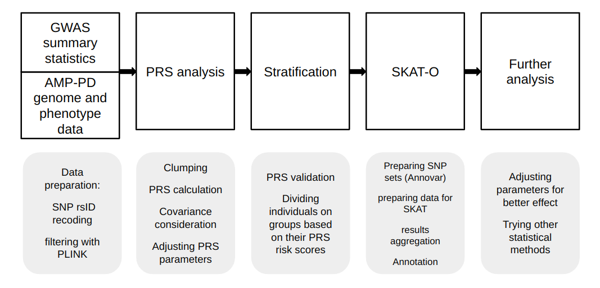

# Discovering New Disease-Associated SNPs through Stratified Polygenic Risk Scores for Parkinson's Disease

n recent years genome-association studies (GWAS) have provided us with crucial data and novel information about the genetic background of many complex diseases, such as Parkinson's disease (PD). To find novel genes involved in, we conducted a polygenic risk score (PRS) analysis using GWAS summary statistics derived from the Accelerating Medicines Partnership Parkinson's Disease (AMP-PD) dataset. PRS analysis was then used to perform stratification of samples based on their genetic risk. To account for the population structure and some other factors, principal components and additional covariates were included in the PRS calculation process.

To further clarify the role of rare variants in PD risk, we prepared the dataset for a subsequent burden analysis using the SKAT-O (Sequence Kernel Association Test - Optimal) framework. Genotype data were processed to identify individuals in the top and bottom 25th percentile of the PRS distribution, enabling a comparative analysis between these groups.



This workflow allows the integration of PRS-based stratification with rare variant burden testing, thereby allowing us to find both common and rare variants with potential cumulative effects on PD, thereby paving the way for enhanced insights into disease pathogenesis and potential therapeutic targets.

The process consists of two different parts:
1. PRS analysis
2. SKAT-O analysis

To run PRS analysis the script `PD_PRS_plink.sh` should be used:

```bash
# how to use
## bfile_prefix=~/scratch/AMP_PD/all_chrs_file
## out=~/scratch/AMP_PD
## name=AMP_PD
## bash PD_PRS.sh $base $bfile_prefix $out $name
```

It will do clumping, PRS calculation and covariance consideration.

After that the results should be taken into account to choose correct p-value threshold for PRS and continue the work.

SKAT-O analysis is run by [`main.sh`](http://main.sh) pipeline and includes processes like dividing individuals into groups by PRS, dividing data into chromosomes, annotating, filtration based on CADD, LoF, expression and mutation type metrics, and SKAT-O itself:

```bash
# how to use
## bash main.sh
```